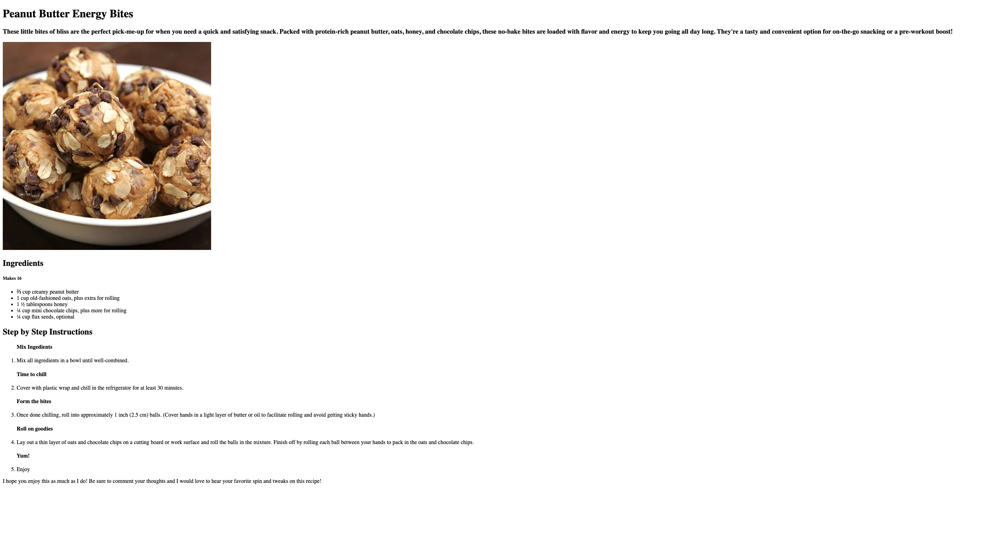

# odin-recipes

# TOP-Recipe Website

A basic HTML project as part of The Odin Project

## Project Description

A recipe website with multiple linked pages

## Technology

- HTML

## Skills Demonstrated

- HTML Structuring and use of semantic elements
- Git and Github
- Troubleshooting

## Future Implementations

- CSS
